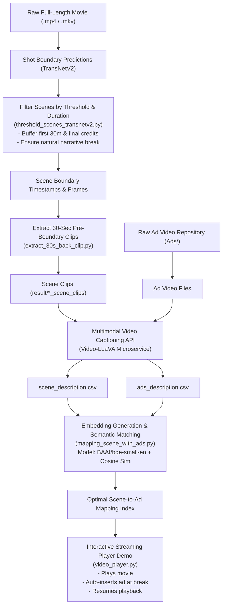

# Multimodal Film Boundary Detection & Advertisement Recommendation

An end-to-end computer vision and multimodal NLP pipeline designed for intelligent, non-disruptive advertisement insertion in full-length movies.

The system automatically detects optimal scene boundaries and transition points using neural shot boundary detection (TransNetV2), extracts contextual clips preceding candidate ad breaks, generates dense visual descriptions using a multimodal Video-LLM (Video-LLaVA), and semantically aligns and recommends the most contextually relevant advertisements using dense sentence embeddings (`BAAI/bge-small-en`) and cosine similarity. It also features a built-in GUI video player demonstrating seamless ad insertion during playback.

---

## 📌 Table of Contents

- [System Architecture](#-system-architecture)
- [Project Features](#-project-features)
- [Directory Structure](#-directory-structure)
- [Prerequisites & Environment Setup](#-prerequisites--environment-setup)
- [Step-by-Step Run Guide](#-step-by-step-run-guide)
  - [Step 1: Scene & Boundary Detection](#step-1-scene--boundary-detection)
  - [Step 2: Context Clip Extraction](#step-2-context-clip-extraction)
  - [Step 3: Generate Multimodal Descriptions](#step-3-generate-multimodal-descriptions)
  - [Step 4: Semantic Ad-to-Scene Matching](#step-4-semantic-ad-to-scene-matching)
  - [Step 5: Run Interactive Video Player Demo](#step-5-run-interactive-video-player-demo)
- [Configuration & Hyperparameters](#-configuration--hyperparameters)
- [Research Foundations](#-research-foundations)
- [License](#-license)

---

## 🏗️ System Architecture



---

## ✨ Project Features

- **Neural Scene Boundary Detection**: Eliminates jarring ad mid-dialogue interruptions by identifying natural visual shot cuts with TransNetV2 and applying configurable temporal exclusion buffers.
- **Context-Aware Pre-Roll Extraction**: Automatically cuts 30-second context windows leading up to each break point for deep multimodal inspection.
- **Multimodal Video Captioning**: Interfaces with a hosted Video-LLaVA model to translate dynamic visual and narrative elements into rich natural language descriptions.
- **Contextual Ad Recommendation**: Encodes scene and ad semantics into dense vector spaces via BGE embeddings, matching ads that resonate with scene tone, themes, and objects.
- **Interactive Simulation Player**: A full Tkinter + OpenCV media player with time scrubbing, frame tracking, dynamic ad injection, and real-time inspector for scene and ad descriptions.

---

## 📂 Directory Structure

```text
multimodel_film_boundary_detection_ads_recommendation/
├── Ads/                                # Repository of candidate advertisement video files
│   └── ads_description.csv            # Generated multimodal descriptions for all ads
├── Movie/                              # Movie datasets, TransNetV2 predictions & cut files
│   ├── Kung Fu Panda (2008)/           # Processed frames, scene timestamps & predictions
│   └── Spiderman 1/                    # Predictions, visualizations & boundary frames
├── Research Paper/                     # Academic literature foundational to this implementation
├── result/                             # Extracted 30s context clips and scene descriptions
│   └── Spiderman 1.mkv_scene_clips/    # Extracted MP4 context clips & scene_description.csv
├── obselete_code/                      # Prototype & PoC scripts (PySceneDetect, Ollama, LLaMA-3)
│   └── README.md                       # Comprehensive documentation for legacy code
├── src/                                # Core processing pipeline modules
│   ├── extract_30s_back_clip.py        # Extracts 30-sec video clips preceding scene cuts
│   ├── mapping_scene_with_ads.py       # Embeds descriptions & performs cosine similarity matching
│   ├── scene_description.py            # Generates descriptions for scene clips via Video-LLaVA API
│   ├── threshold_scenes_transnetv2.py  # Filters TransNetV2 predictions to determine ad break points
│   ├── utils.py                        # Timecode and frame conversion utilities
│   └── video_player.py                 # Interactive GUI player demonstrating ad insertion
├── ads_description.py                  # Generates descriptions for ads via Video-LLaVA API
├── main.py                             # Unified pipeline runner for single movie execution
├── requirements.txt                    # Project Python package dependencies
```

---

## ⚙️ Prerequisites & Environment Setup

### 1. System Requirements
- **OS**: Windows 10/11, macOS, or Linux.
- **Python**: Python 3.10, 3.11, or 3.12.
- **Hardware**: GPU recommended for embedding inference; CPU works out-of-the-box.

### 2. Clone the Repository
```bash
git clone https://github.com/Lakshay-Bansal/multimodel_film_boundary_detection_ads_recommendation.git
cd multimodel_film_boundary_detection_ads_recommendation
```

### 3. Create and Activate a Virtual Environment

**Using `venv` (Windows PowerShell):**
```powershell
python -m venv venv
.\venv\Scripts\Activate.ps1
```

**Using `venv` (Linux/macOS):**
```bash
python3 -m venv venv
source venv/bin/activate
```

**Using Conda:**
```bash
conda create -n film_ads python=3.12 -y
conda activate film_ads
```

### 4. Install Dependencies
```bash
pip install --upgrade pip
pip install -r requirements.txt
```

### 5. Setup Video-LLaVA Endpoint
The captioning scripts (`ads_description.py` and `scene_description.py`) query a Video-LLaVA microservice via HTTP POST:
- Ensure your Video-LLaVA service is running (or hosted remotely).
- Update the `url` variable in `ads_description.py` and `scene_description.py` with your server IP and port:
  ```python
  url = 'http://<YOUR_SERVER_IP>:8084/describe_video'
  ```
*(Note: If you already have `ads_description.csv` and `scene_description.csv` precomputed in `Ads/` and `result/`, you can jump straight to testing embedding matching and the video player without running the Video-LLaVA server).*

---

## 🚀 Unified Pipeline Execution (`main.py`)

The easiest way to execute the entire end-to-end operation for a single movie file is using [`main.py`](./main.py), which orchestrates your modular logic in [`src/`](./src/):

```bash
# Run pipeline on a movie with default parameters:
python main.py "Spiderman 1.mkv"

# Run pipeline on another movie:
python main.py "Kung Fu Panda (2008).mp4"

# Custom shot length or TransNetV2 threshold:
python main.py "Spiderman 1.mkv" --shot-size 50 --threshold 0.75

# Run pipeline and immediately launch the interactive video player GUI demo:
python main.py "Spiderman 1.mkv" --play
```

### CLI Parameters & Flags:

| Parameter | Type | Default | Description |
|---|---|---|---|
| `movie_name` | Positional | `"Spiderman 1.mkv"` | Target movie filename (e.g. `'Spiderman 1.mkv'` or `'Kung Fu Panda (2008).mp4'`). |
| `--shot-size` | `int` | `50` | Minimum shot length in frames to qualify as a cut candidate. |
| `--threshold` | `float` | `0.7` | TransNetV2 cut probability threshold. |
| `--play` | Flag | `False` | Launch interactive desktop video player GUI after processing completes. |

---

## 🔬 Modular Step-by-Step Run Guide

If you prefer executing individual pipeline components manually:

### Step 1: Scene & Boundary Detection
Filter raw TransNetV2 model frame predictions to identify suitable ad-break timestamps:
```bash
python src/threshold_scenes_transnetv2.py
```
- **Inputs**: `Movie/<movie_name>.predictions.txt`
- **Outputs**:
  - `Movie/<movie_name>.theshold_scenes.txt`: Array of `[start_frame, end_frame]` pairs.
  - `Movie/<movie_name>.theshold_scenes_timestamp.txt`: Timestamped boundaries.

---

### Step 2: Context Clip Extraction
Extract 30-second context subclips immediately preceding each identified boundary:
```bash
python -c "from src.extract_30s_back_clip import generate_30s_back_scene_clips; generate_30s_back_scene_clips('Spiderman 1.mkv')"
```
- **Inputs**: Video file (`Movie/<movie_name>`) and boundary frames (`Movie/<movie_name>.theshold_scenes_final.txt`).
- **Outputs**: Saved in `result/<movie_name>_scene_clips/` as numbered MP4 files (`1_<frame>.mp4`, `2_<frame>.mp4`, etc.).

---

### Step 3: Generate Multimodal Descriptions

#### 3a. Describe Advertisements:
```bash
python ads_description.py
```
- Scans `Ads/` for MP4 ad files, streams them to the Video-LLaVA API, and compiles `Ads/ads_description.csv`.

#### 3b. Describe Scene Clips:
```bash
python -c "from src.scene_description import generate_scene_desc; generate_scene_desc('Spiderman 1.mkv')"
```
- Scans `result/<movie_name>_scene_clips/`, requests visual captions, and saves `result/<movie_name>_scene_clips/scene_description.csv`.

---

### Step 4: Semantic Ad-to-Scene Matching
Evaluate semantic similarity between scene context descriptions and ad inventory:
```bash
python src/mapping_scene_with_ads.py
```
- Generates 384-dimensional text embeddings using `BAAI/bge-small-en`.
- Computes cosine similarity matrices between all ads and scene clips.
- Selects the argmax ad index for each scene break.

---

### Step 5: Run Interactive Video Player Demo
Launch the desktop media player to simulate real-time playback and dynamic ad insertion:
```bash
python src/video_player.py
```

#### Player Controls & Interface:
- **Load Video**: Open a movie file to start playback.
- **Next Scene / Previous Scene**: Jump directly to candidate ad break points.
- **Scrubbing**: Use `Next 30s` / `Back 30s` buttons.
- **Scene Boundary List**: Scrollable pane showing all detected frame cut points.
- **Scene Description Pane**: Displays the Video-LLaVA description of the scene context.
- **Recommended Ad Pane**: Displays description and automatically loads and plays the semantically matched ad when the boundary frame is hit.

---

## 🔧 Configuration & Hyperparameters

In [`src/threshold_scenes_transnetv2.py`](./src/threshold_scenes_transnetv2.py):
- `threshold = 0.7`: TransNetV2 probability threshold for shot transition classification.
- `shot_size = 50`: Minimum frame duration for a distinct continuous shot.
- `start > 43164`: Exclusion offset (e.g., skips first ~30 minutes at 24 FPS to avoid opening scenes).
- `len(predictions) - 43164`: Exclusion offset for end credits.

In [`src/mapping_scene_with_ads.py`](./src/mapping_scene_with_ads.py):
- `model_name = "BAAI/bge-small-en"`: Hugging Face transformer model used for dense semantic embeddings.


---

## 📚 Research Foundations

The architectures and heuristics in this repository are based on foundational literature archived in [`Research Paper/`](./Research%20Paper/):
- **TransNet V2**: *An Effective Deep Network Architecture for Fast Video Shot Transition Detection*.
- **DEEP-AD**: *A Multimodal Temporal Video Segmentation Framework for Online Video Advertising*.
- **Local-to-Global Movie Scene Segmentation (SceneSeg)**.
- **Boundary-aware Self-supervised Learning for Video**.
- **Video-LLaVA / Video-LLaMA**: Multimodal Foundation Models for Video Understanding.

---

## 📄 License

This project is licensed under the MIT License - see the [LICENSE](./LICENSE) file for details.
